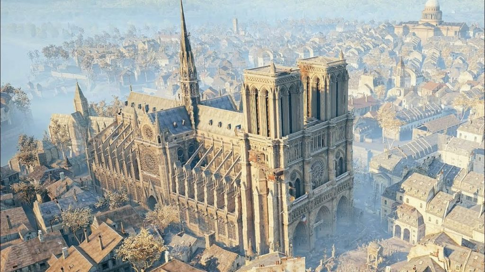
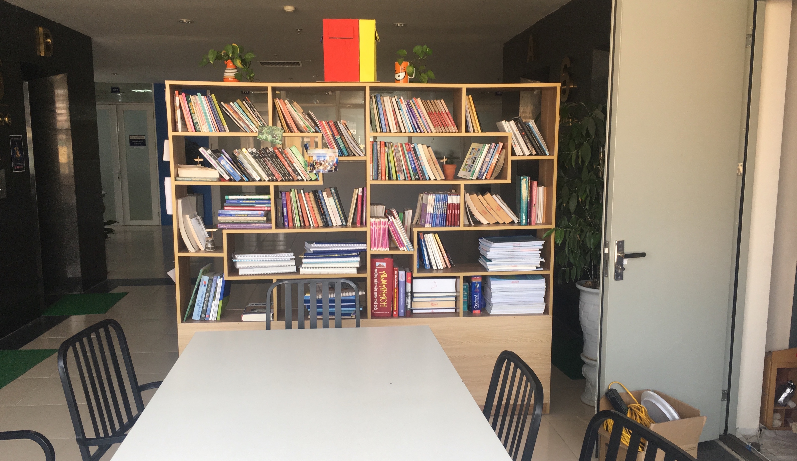
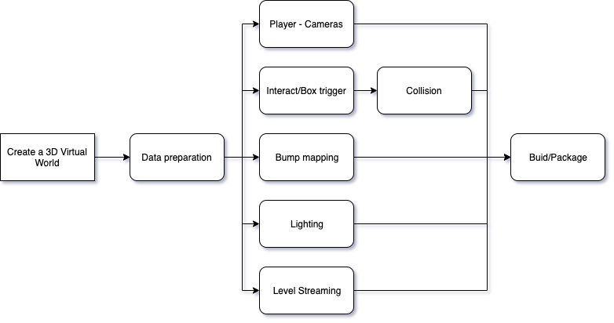
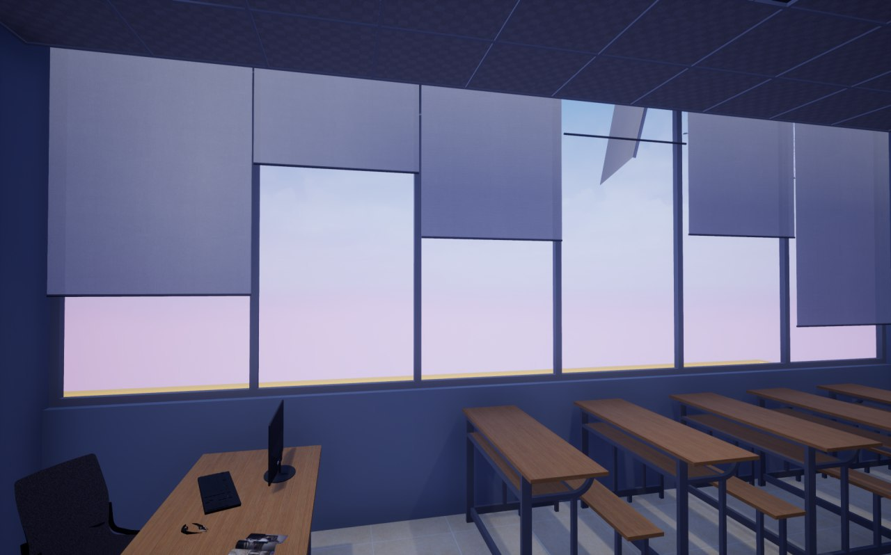
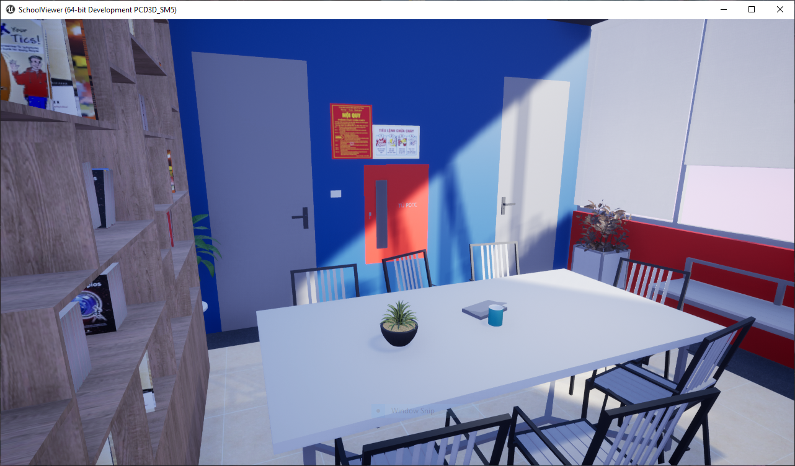
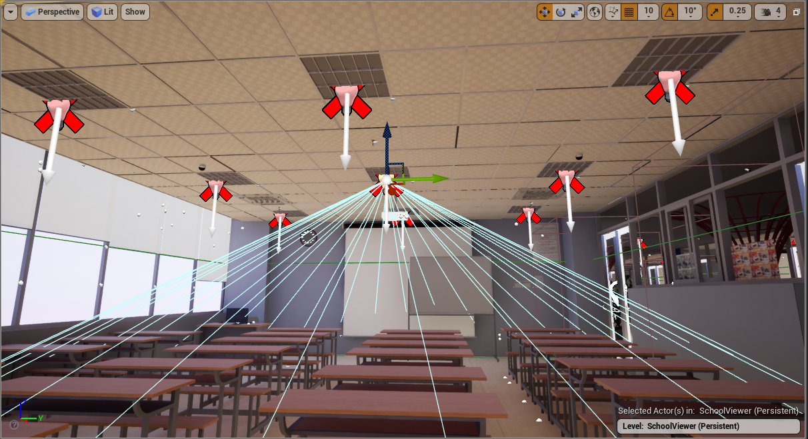
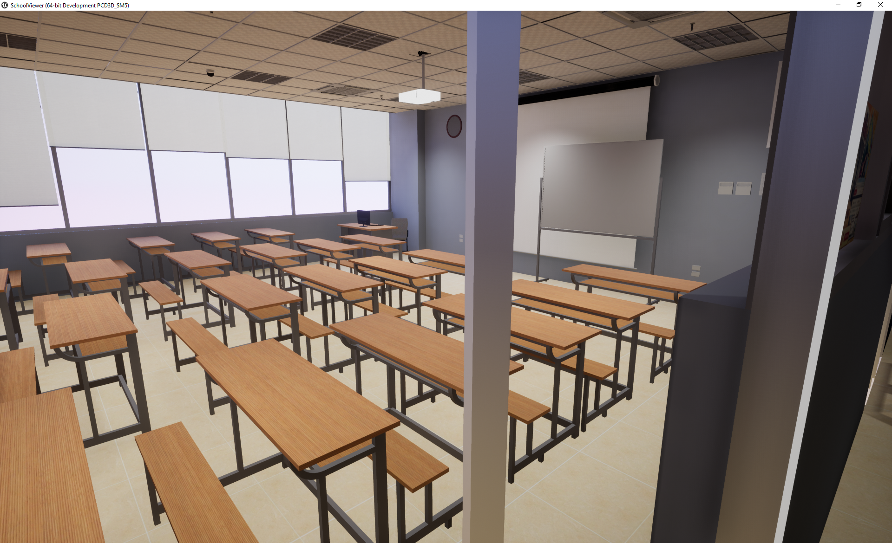

---
# pandoc main.md -H preamble.tex -t beamer -o main.pdf --slide-level=2
title: "Development of USTH Interactive Virtual World using Unreal Engine"
author: \textbf{Presenter:} Do Duy Huy Hoang \newline 
		\thinspace \textbf{Supervisor:} Dr. Tran Giang Son
date: \today{}
institute: 
- ICT Department - USTH
theme:
- Ilmenau
colortheme:
- default 
innertheme:
- circles 
outertheme:
- miniframes 
header-includes:
- \newcommand{\hideFromPandoc}[1]{#1}
- \hideFromPandoc{
    \let\Begin\begin
    \let\End\end
  }
mainfont: "SourceSansPro-Regular"
caption-justification: centering
## Outline
toc:
- true
---

# Introduction
## Introduction to Virtual World

**Definition:** a virtual world  is a computer-based simulated environment which may be populated by many users who can create a personal avatar for interaction

## Applications of Virtual World

Today’s virtual worlds are being used for many application domains such as entertainment, education and training, tourism, etc. Virtual world is even becoming better than the real world

\hspace{0.3cm}
\Begin{columns}

\Begin{column}{0.5\textwidth}

\End{column}
\Begin{column}{0.5\textwidth}

\End{column}
\End{columns}

\begin{figure}[!h]
\caption{Example of 3D Virtual Worlds.}
\end{figure}

## Tools to build Virtual Worlds
* Unreal Engine
* SketchUp
* 3DSMax, Substance Painter, Adobe Tools

\begin{figure}
\centering
{\includegraphics[width=2.9in]{../docs/sketch+unreal.jpg}}
\caption{SketchUp and Unreal Engine.}
\end{figure}

## Building a virtual world for USTH

We propose to build a 3D virtual world for USTH building. The goal is to create an **image of USTH** so that a wide range of USTH students and parents can interactively explore USTH

To gain this goal, we do the following tasks:

- *Collect* a dataset of 2D images for different views of USTH
- *Conduct* fully 3D models from collected 2D images
- *Build* a realtime and interactive 3D virtual world of USTH from constructed 3D models	

# Methodology
## Workflow

{ width=\linewidth }

## 1. Input Data

\begin{tikzpicture}[remember picture,overlay]  
  \node [xshift=-2cm,yshift=-2cm] at (current page.north east)
    {\includegraphics[width=4cm,height=4cm]{workflow2.png}};
\end{tikzpicture}

Our input data include: 2D panoramic pictures, floor plans, videos with different views of USTH

\hspace{0.3cm}
\Begin{columns}
\Begin{column}{0.5\textwidth}

\End{column}
\Begin{column}{0.5\textwidth}

\End{column}
\End{columns}

\begin{figure}[!h]
\caption{Examples of Input Data.}
\end{figure}

## 2. 3D Modelling

- 3D modeling is a process of creating a 3D representation of any surface or object by manipulating polygons, edges, and vertices in simulated 3D space.
- 3D modeling work flow:

\begin{figure}
\centering
{\includegraphics[width=\linewidth]{mainphase.png}}
\end{figure}

## 2a. Ground Prep / Wall Structure
\begin{tikzpicture}[remember picture,overlay]  
  \node [xshift=-2cm,yshift=-1.8cm] at (current page.north east)
    {\includegraphics[width=4cm,height=4cm]{mainphase.png}};
\end{tikzpicture}

\Begin{columns}
\Begin{column}{0.5\textwidth}

- Transfer 2D legacy floor plan images into a digital version.
- Structure walls  using offset tool - allow drawing a offset of a perimeter. 

\End{column}
\Begin{column}{0.5\textwidth}

{ width=85% }

\End{column}

\End{columns}

\Begin{columns}
\Begin{column}{0.5\textwidth}

{ width=85% }

\End{column}
\Begin{column}{0.5\textwidth}
{ width=85% }

\End{column}
\End{columns}

## 2b. Furniture Creation

\begin{tikzpicture}[remember picture,overlay]  
  \node [xshift=-2cm,yshift=-2.2cm] at (current page.north east)
    {\includegraphics[width=4cm,height=4cm]{mainphase.png}};
\end{tikzpicture}

We need to fix the following problems with 3DSmax to create standalone objects:

- Fix pivot, edit UV mapping of some models
- Correct the position of the texture
- To use with **Level Streaming** technique in UE4
- Avoid duplicate models

\Begin{columns}
\Begin{column}{0.5\textwidth}

{ width=85% }

\End{column}
\Begin{column}{0.5\textwidth}

{ width=85% }

\End{column}
\End{columns}

## 2c. 3D Model result

\begin{tikzpicture}[remember picture,overlay]  
  \node [xshift=-2cm,yshift=-2.2cm] at (current page.north east)
    {\includegraphics[width=4cm,height=4cm]{mainphase.png}};
\end{tikzpicture}

\Begin{columns}
\Begin{column}{0.5\textwidth}

\End{column}
\Begin{column}{0.5\textwidth}

\End{column}
\End{columns}

\begin{figure}[!h]
\caption{SketchUp models vs Reality}
\end{figure}

## 3. Making 3D Virtual world

## 3a. Data preparation
\begin{tikzpicture}[remember picture,overlay]  
  \node [xshift=-2cm,yshift=-2.4cm] at (current page.north east)
    {\includegraphics[width=3cm,height=3cm]{UE.png}};
\end{tikzpicture}

- Export 3D models to *datasmith* type
- Furnitures / Standalone object will be imported manually into Unreal Engine
- Materials / Assets / Layers / Scales are same as in SketchUp, but sometimes need to tweak some values

{ width=50% }

## 3b. Player / Cameras 
\begin{tikzpicture}[remember picture,overlay]  
  \node [xshift=-2cm,yshift=-2.8cm] at (current page.north east)
    {\includegraphics[width=4cm,height=4cm]{UE.png}};
\end{tikzpicture}

- First person view
- Camera attached into the player
- *Scene* from Sketch is shipped to Unreal Engine

\Begin{columns}
\Begin{column}{0.5\textwidth}

\End{column}
\Begin{column}{0.5\textwidth}

\End{column}
\End{columns}

\begin{figure}[!h]
\caption{Player start and Cameras actor}
\end{figure}

## 3c. Interact / Collison / Box Trigger

- Collision used to cause an event to occur - block/overlap
- Can be used to create event

{ width=75% }

## 3d. Bump mapping
\Begin{columns}
\Begin{column}{0.5\textwidth}
\small
- Same number of polygons on both models
- A normal map is an image texture mapped to the surface of a model
-  Using a texture to store information

\End{column}
\Begin{column}{0.5\textwidth}
{ width=90% }

\End{column}
\End{columns}

\Begin{columns}
\Begin{column}{0.5\textwidth}

{ width=80% }

\End{column}
\Begin{column}{0.5\textwidth}
{ width=80% }

\End{column}
\End{columns}
\begin{figure}[!h]
\caption{Left: Smooth shading on three polygons. Right:Normal mapping across three polygons / viewed as a 2D diagram}
\end{figure}

## 3e. Normal Map
\begin{tikzpicture}[remember picture,overlay]  
  \node [xshift=-2cm,yshift=-2.5cm] at (current page.north east)
    {\includegraphics[width=3cm,height=3cm]{UE.png}};
\end{tikzpicture}

\hspace{7cm}
\Begin{columns}
\Begin{column}{0.5\textwidth}

\End{column}
\Begin{column}{0.5\textwidth}

\End{column}
\End{columns}
\begin{figure}[!h]
\caption{With/Without Normal map}
\end{figure}

## 3f. Level Streaming
\begin{tikzpicture}[remember picture,overlay]  
  \node [xshift=-2cm,yshift=-2.8cm] at (current page.north east)
    {\includegraphics[width=4cm,height=4cm]{UE.png}};
\end{tikzpicture}

- A quick and easy way to work on a larger game in smaller chunk
- Less resources
- Individual maps

## 3g. Lighting 
\begin{tikzpicture}[remember picture,overlay]  
  \node [xshift=-2cm,yshift=-1.6cm] at (current page.north east)
    {\includegraphics[width=3cm,height=3cm]{UE.png}};
\end{tikzpicture}

{ width=90% }

## 3h. Build/Packaging
\begin{tikzpicture}[remember picture,overlay]  
  \node [xshift=-2cm,yshift=-2.8cm] at (current page.north east)
    {\includegraphics[width=4cm,height=4cm]{UE.png}};
\end{tikzpicture}

Supported platforms:

- Native Application 	
	- Linux
	- Window
	- MacOS 

- Web Application
	- http://scg.sontg.net/HTML5/tanghamfinal.html

{ width=40% }

# Results and Discussion

## Results

\Begin{columns}
\Begin{column}{0.5\textwidth}

{ width=70% }

\End{column}

\Begin{column}{0.5\textwidth}

{ width=70% }

\End{column}

\End{columns}

\Begin{columns}
\Begin{column}{0.5\textwidth}

{ width=65% }

\End{column}
\Begin{column}{0.5\textwidth}
{ width=65% }

\End{column}
\End{columns}

\Begin{columns}
\Begin{column}{0.5\textwidth}

{ width=65% }

\End{column}
\Begin{column}{0.5\textwidth}
{ width=65% }

\End{column}
\End{columns}

## Results
### Dataset of 2D images: 
- **726 images**, **18 videos** with different views of USTH with: High resolution, Easily captured, Cheap, Popular

### Raw 3D models of USTH 
- **6 3D models**, **300+ different objects and textures**
- Foundations for other reaseacher or developer to create others virtual world of USTH

### Fully interactive virtual world of USTH 
Succesfully implement 3 floors ( 7th floor, 4th floors and 1st floor ) to create a virtual world with Unreal Engine

- Lighting 
- Shading
- 30 blueprints

# Conclusion and Future Works
## Conclusion and Future Work

- Better material
- Increase frame rate
- Add more interactions
- Ray Tracing
- Finish all others floors

## 
\centering
Thank you for listening!!!
